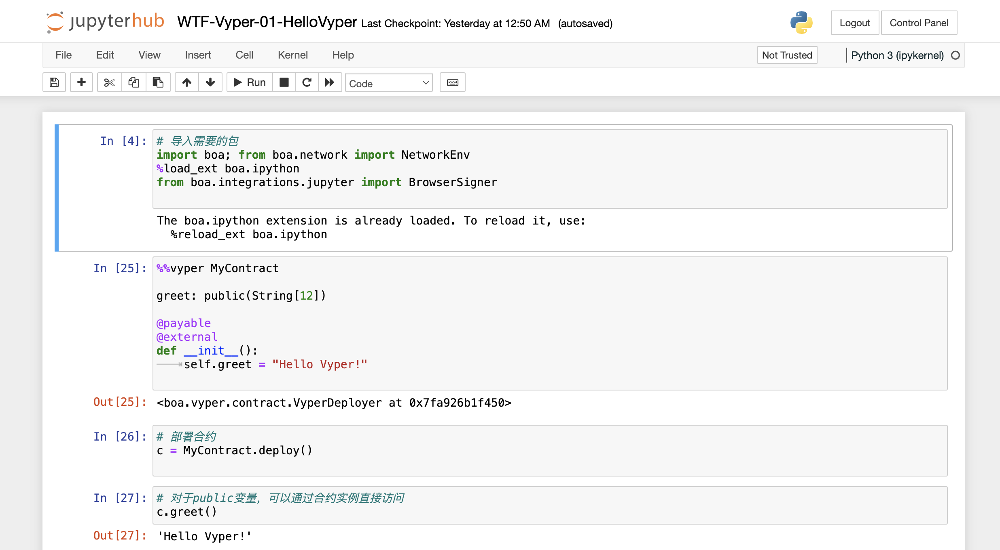

# WTF Vyper教程: 1. Hello Vyper

我最近在重新学Vyper，巩固一下细节，也写一个“Vyper极简入门”，供小白们使用（编程大佬可以另找教程），每周更新1-3讲。

推特：[@WTFAcademy_](https://twitter.com/WTFAcademy_)

社区：[Discord](https://discord.gg/5akcruXrsk)｜[微信群](https://docs.google.com/forms/d/e/1FAIpQLSe4KGT8Sh6sJ7hedQRuIYirOoZK_85miz3dw7vA1-YjodgJ-A/viewform?usp=sf_link)｜[官网 wtf.academy](https://wtf.academy)

所有代码和教程开源在github: [github.com/WTFAcademy/WTF-Vyper](https://github.com/WTFAcademy/WTF-Vyper)

## Vyper简述

Vyper 是一种面向合约的类似于 Python 的编程语言，专为`EVM`设计。与Solidity不同，Vyper强调简单性和安全性，而Solidity则提供更多灵活性和复杂特性。

## 开发环境
与Solidity不同，`Remix`只支持Vyper `0.2.16` 以下的版本，而最新版是Vyper `0.3.10`，因此我们不得不转向其他开发环境。

这里，我们主要介绍两个开发环境

1. 本地开发（**推荐**），需要在本地安装`Vyper`和`ApeWorx`。
2. 浏览器IDE：[链接](https://try.vyperlang.org/)

## 本地开发
### 1. 安装Vyper
使用 `Docker` 和 `PIP` 可安装Vyper。此处使用 `PIP`，其他安装方法见[Vyper官方文档](https://docs.vyperlang.org/en/latest/installing-vyper.html)。

```bash
pip3 install vyper
# 或
pip3 install vyper==0.3.9
```
安装的Vyper版本取决于当前Python版本。

### 2. 安装ApeWorX
ApeWorX是一个与Vyper完全兼容的智能合约开发框架。另一框架`brownie`已停止更新。ApeWorX官网: [ApeWorX](https://apeworx.io)。

```bash
pip3 install eth-ape
```

### 3. 安装插件

开发常用插件包括 `hardhat` 和 `alchemy`。使用`alchemy`需要本地设置`key`，详情见[这里](https://academy.apeworx.io/articles/account-tutorial)。

```bash
ape plugins install hardhat alchemy
```

### 4. 初始化项目

```bash
ape init
```

**ape-config.yaml 文件示例配置**
以 `ethereum-fork` 为例的配置信息：

```yaml
name: HelloVyper

plugins:
  - name: alchemy
  - name: etherscan
  - name: hardhat

default_ecosystem: ethereum

ethereum:
  default_network: mainnet-fork
  mainnet_fork:
    default_provider: hardhat
    transaction_acceptance_timeout: 99999999
  mainnet:
    transaction_acceptance_timeout: 99999999

hardhat:
  port: auto
  fork:
    ethereum:
      mainnet:
        upstream_provider: alchemy
        enable_hardhat_deployments: true

test:
  mnemonic: test test test test test test test test test test test junk
  number_of_accounts: 5
```

遇 `PUSH0` 错误时，在 `ape-config` 文件中添加：

```yaml
vyper:
  evm_version: paris
```

## 编写第一个Vyper合约

我们的第一个Vyper合约非常简单，仅包含几行代码：

```vyper
# @version 0.3.9

greet: public(String[12])

@payable
@external
def __init__():
	self.greet = "Hello Vyper!"
```

代码逐行分析：
1. 指定Vyper编译器版本 `0.3.9` 或 `>=0.3.9`。
2. 声明`public`变量`greet`：`public(String[12])`。
3. `@payable` 和 `@external` 装饰器。
4. `__init__`：合约的构造函数。
5. 设置 `greet` 变量的初始值。

## 编译并部署代码
在合约文件夹下输入命令进行编译：

```bash
ape compile
```


部署合约步骤：
1. 进入 `ape` 控制台，部署到 `ethereum-fork`。
2. `ape` 分配测试账户并添加ETH：

```python
from ape import accounts

accounts[0].balance += int(1e18)
```


3. 执行部署命令：

```python
contract = accounts[0].deploy(project.HelloVyper)
```


## 使用浏览器IDE开发

对于简单的合约，你可以在[https://try.vyperlang.org/](https://try.vyperlang.org/)网站托管的jupyter notebook上进行开发。

首先，你需要导入[boa](https://github.com/vyperlang/titanoboa)包，它是一个Vyper解释器，支持在jupyter notebook中运行Vyper合约。

```python
# 导入需要的包
import boa; from boa.network import NetworkEnv
%load_ext boa.ipython
from boa.integrations.jupyter import BrowserSigner
```

第二步，复制粘贴我们的Vyper合约。

```vyper
%%vyper MyContract

greet: public(String[12])

@payable
@external
def __init__():
	self.greet = "Hello Vyper!"
```

第三步，部署Vyper合约，并赋值给合约变量`c`：

```python
# 部署合约
c = MyContract.deploy()
```

最后一步，与部署好的合约`c`交互，读取`greet`变量的值，将输出`'Hello Vyper!'`。

```vyper
# 对于public变量，可以通过合约实例直接访问
c.greet()
```



## 总结

这一讲，我们介绍了Vyper语言，它的开发环境，并编写和部署第一个合约 `HelloVyper`。后续我们将更深入的学习Vyper！
