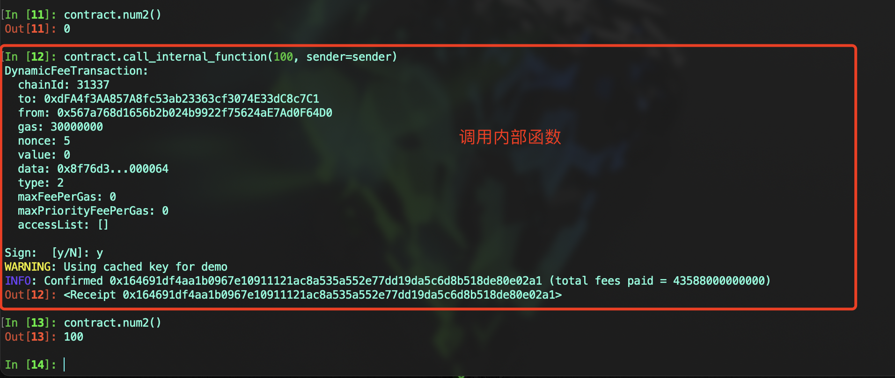
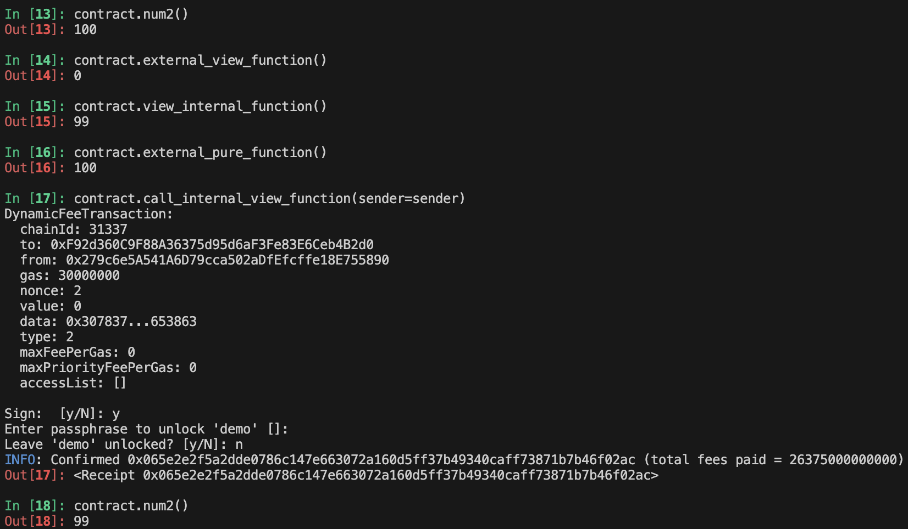

# WTF Vyper 教程: 3. 函数

Vyper 中的函数是合约内可执行的代码单元，只能在合约的模块范围内声明. 所有的合约方法必须要声明函数是外部函数(external)还是内部函数(internal)，如果不声明编译会失败.

## 函数类型参考

函数的类型是通过添加装饰器的方式来完成，Vyper 中总共有 6 种装饰器，我们将它分为 3 类：可见性、可变性和重入锁。

1. 可见性
   - `external`: 用于标识外部函数，这类函数是合约接口的一部分，只能通过交易或从其他合约调用 ​
   - `internal`: 用于标识内部函数，内部函数只由同一合约内的其他函数中可访问，通常通过 `self.f()` 对象调用, `f()`为方法名 ​
2. 可变性
   - `view`: 表示函数是一个只读函数，可以读取但不修改合约状态
   - `pure`: 表示函数是一个`pure`函数，既不会读取也不修改合约状态
   - `payable`: 表示函数可以接收 ETH，可以读写合约状态. 只有标记为 `@payable` 的函数才能接收 ETH 转账
3. 重入锁
   - nonreentrant("key"): 用于防止函数的重入，当尝试从外部合约再次调用加锁的函数时，交易会回滚

## 函数基本结构

一个基本的函数定义包括函数名、参数列表（可选）和返回值（可选）

代码示例：

```
@external
def my_function(param: uint256) -> bool:
    ...
```

- `@external`: 外部函数修饰符
- `def`: 声明函数时的固定用法，与 Python 类似
- `my_function`: 函数名，代码风格遵循 [Curve.fi](https://curve.readthedocs.io/guide-code-style.html) 标准
- `param`: 函数的参数，可选的
- `bool`: 函数返回值，可选的

### 1. external & internal

代码示例：

```
num2: public(uint256)

@internal
def _internal_function(_new_num: uint256):
	self.num2 = _new_num

@external
def call_internal_function(_new_num: uint256):
	self._internal_function(_new_num)
```

示例中，我们定义了一个内部函数 `_internal_function`, 每次调用都更新 `num2` 的值，它只能由合约内部调用。然后我们再定义了一个外部函数 `call_internal_function`，用来调用内部函数 `_internal_function`



### 2. view & pure

- `view` 表示函数是一个视图函数，可以读取但不修改合约的状态。常用于获取合约的当前状态或计算结果，而不产生任何区块链上的状态变化
- `pure` 表示函数既不会读取也不会修改合约的状态。通常用于执行纯粹的计算或返回常量值 ​
- `view` 和 `pure` 都可以成为为内部函数和外部函数

代码示例：

```
num1: public(uint256)
num2: public(uint256)

@view
@external
def external_view_function() -> uint256:
	return self.num1

@view
@internal
def _internal_view_function() -> uint256:
	return 99

@view
@external
def view_internal_function() -> uint256:
	return self._internal_view_function()

@external
def call_internal_view_function():
	self.num2 = self._internal_view_function()

@pure
@external
def external_pure_function() -> uint256:
	return 100
```



### 3. payable

只有标记为 `@payable` 的构造函数或者功能函数才能接收 ETH 转账。特殊情况下不想要指定函数接收 ETH，那么可以使用 Vyper 的内置函数 `__default__`，使用 default 函数表示允许合约接收 ETH，用户可以直接往合约地址里转入 ETH

代码示例：

```
@payable
@external
def __init__():
	pass

@payable
@external
def receipt_eth():
	pass

@payable
@external
def __default__():
	pass
```


### 4. nonreentrant

`nonreentrant` 修饰符用于防止函数的重入，确保函数在同一交易中不会被重复调用, 非常重要的安全特性，尤其在处理资金交易时。

可重入锁可以分为两种状态: 激活和非激活。当调用标记 `nonreentrant` 的函数时，状态为：

- 确保不处于活动状态
- 函数设置为激活状态

一旦函数调用结束，状态为：

- 函数设置为非激活状态

通过这种机制，用户可以确保该函数只能在调用结束后才能重新调用，这意味着无论执行什么外部调用都不会发生重入。

#### 代码示例

```
@nonreentrant("lock")
@external
def sensitive_function():
    pass
```

## 总结

 在本节中，我们介绍了 Vyper 的函数类型。在开发合约过程中需要根据函数的用途和需要的安全级别来选择合适的类型。
