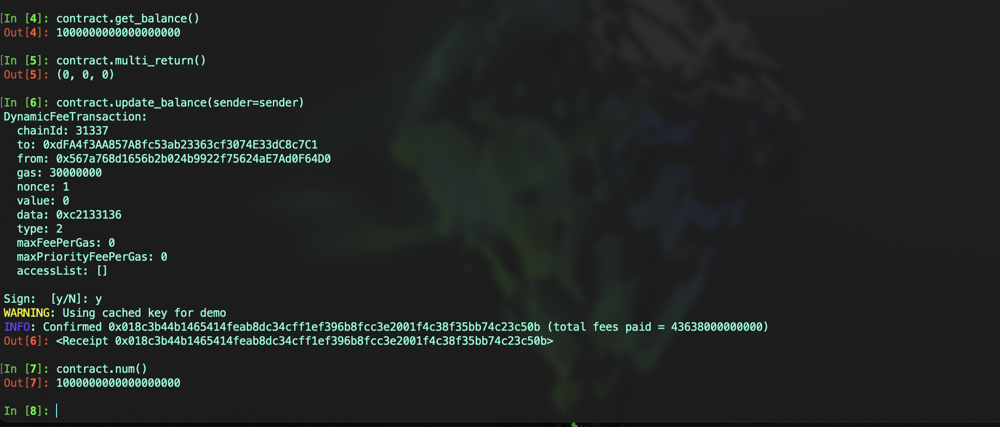

# Vyper 入门： 4. 函数输出
### 与Solidity不同，Vyper中只有一个关键字 `return`, 这通常用于函数执行后返回给调用者的计算结果或合约状态

## 定义函数输出
#### 在Vyper中，函数输出的方式通常在定义函数时指定输出类型，用 `->` 符号后面跟类型来表示
#### 代码示例
```
@view
@external
def get_balance() -> uint256:
	return self.balance
```

## 多个输出
#### Vyper也允许函数返回多个值，用逗号分隔各个返回值
#### 代码示例
```
num1: public(uint256)
num2: public(uint256)
num3: public(uint256)

@view
@external
def multi_return() -> (uint256, uint256, uint256):
	return self.num1, self.num2, self.num3
```

## 如何使用
#### 调用函数时，可以接收并使用这些返回值，可以直接使用或存储于变量中。
#### 代码示例
```
num: public(uint256)

@view
@internal
def get_balance() -> uint256:
	return self.balance

@external
def update_balance():
	self.num = self.get_balance()
```



## 总结
#### 在本节中，我们介绍了函数输出 `return` 的用法，需要注意的是确保返回类型与函数定义匹配，并且考虑输出的可读性和易用性，特别是在返回多个值时。
