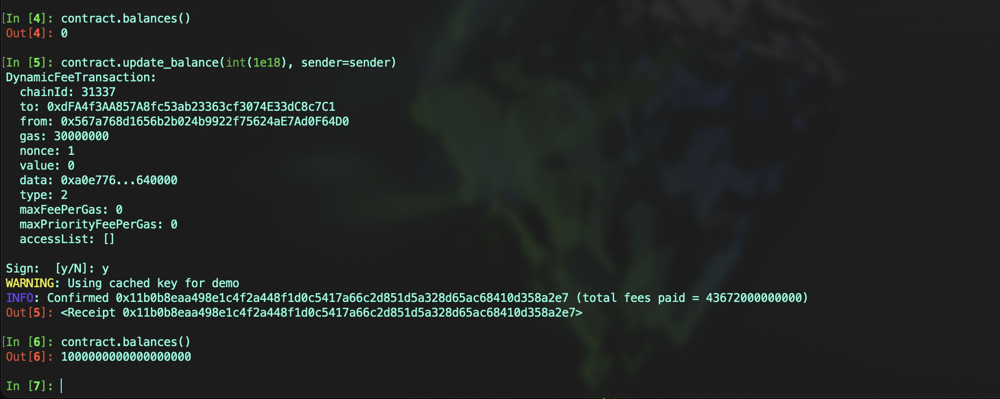
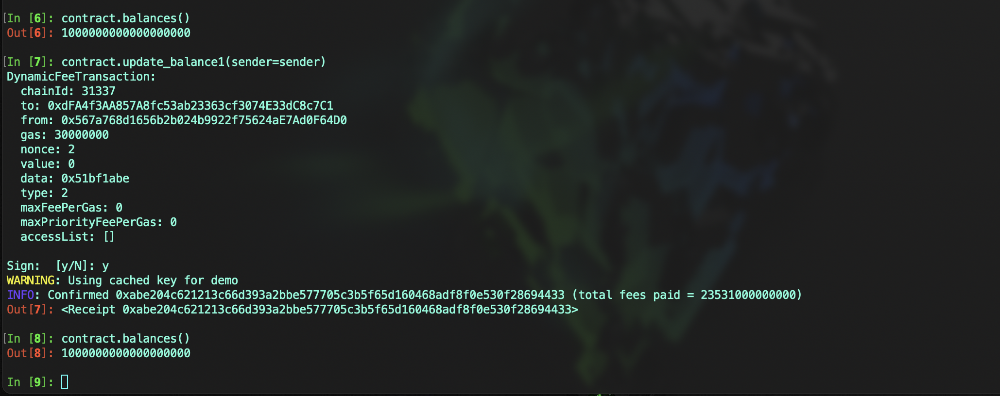
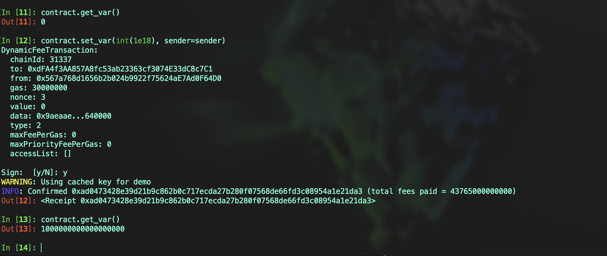

# Vyper 入门： 5. 变量数据存储和作用域
### 在Vyper中，变量根据存储位置分为四类：存储（Storage）、内存（Memory）、不可变量（immutable）和常量（constant）。变量的作用域则是决定了在哪里可以访问这些变量。

## 1. 数据存储
#### Vyper中的数据储存位置有四类：Storage、Memory、Immutable和Constant。需要注意的是，与Solidity不同的是，在函数中Vyper不需要通过数据类型的关键字存储数据，而是直接声明。

### 存储(Storage)：
- 存储变量是合约状态的一部分，永久存储在区块链上
- 它们在合约的整个生命周期内保持不变，除非被显式修改
- 存储变量只能在函数外部声明，无法在函数内部声明

#### 代码示例
```
owner: public(address)
balances: uint256
```
#### 有一点需要补充是，在存储中如果看到 `public`关键字，代表这个变量是可读的，作用与 `view` 函数一样，反之则是内部变量。

#### 几种使用场景
1. 直接给存储变量赋值，则会改变变量的值

```
balances: public(uint256)

@external
def update_balance(_new_balance: uint256):
	self.balances = _new_balance
```


2. 存储变量给内存变量赋值，修改内存变量的值不会影响存储变量

```
balances: public(uint256)

@external
def update_balance1():
	memory_balance: uint256 = self.balance
	memory_balance += 1
```



### 内存(Memory)
- 内存变量是临时的，仅在函数执行期间存在
- 它们用于存储函数执行期间的临时数据和中间计算结果
- 内存变量只能在函数内部声明，无法在函数外部声明

#### 代码示例
```
@view
@external
def update_balance(_new_balance: uint256) -> uint256:
	balance: uint256 = 100
	return balance * _new_balance
```

### 3. 不可变量(immutable)
- `immutable` 变量在部署合约时在 `构造函数` 中设定，之后不能更改
- 它们比常规存储变量更节约 `gas`，因为在编译时会被直接替换成相应的值
- 声明 `immutable` 的变量不能直接被调用，如果需要访问，需要额外编写视图函数调用
- 不可变量的代码编写风格一般约定俗成为全大写，例如 `IMMUTABLE`

#### 代码示例
```
NUMBER: immutable(uint256)

@payable
@external
def __init__():
	NUMBER = 100

# 额外编写一个访问函数
@view
@external
def get_immutable_number() -> uint256:
	return NUMBER
```


### 4. 常量(constant)
- `constant` 是编译时确定的常数，不占用存储空间
- 它们通常用于定义不变的值，如哈希、地址、最大容量
- 和 `immutable`一样，声明 `constant` 的变量不能直接被调用，如果需要访问，需要额外编写视图函数调用
- 常量的代码编写风格一般约定俗成为全大写，例如 `CONSTANT`

#### 代码示例
```
OWNER: constant(address) = 0xEeeeeEeeeEeEeeEeEeEeeEEEeeeeEeeeeeeeEEeE

@view
@external
def get_owner() -> address:
	return OWNER
```


## 2. 变量作用域
#### 变量的作用域决定了在哪里可以访问这些变量。Vyper中总共有3种作用域：全局变量(global variable)、局部变量(local variable)和状态变量(state variable)。

### 1. 全局变量
#### 全局变量可以在合约的任何函数中访问，可以细分为环境变量(environment variable)、自变量(self variable)和自定义常量(custom constant).
- `环境变量`: 环境变量是Vyper预留的关键字，主要用于提供有关区块链或当前交易的信息，不需要声明就可以直接使用
- `自变量`：自变量是一个环境变量，用于从自身内部引用合约，通常用 `self` 来调用
- `自定义常量`：Vyper允许自定义全局常量，通常使用 `constant` 和 `immutable` 关键字来声明

#### 环境变量
#### 我们在编写合约时常用的关键有 `msg.sender`、`block.number` 和 `msg.data`, 分别代表当前调用者、当前区块号和消息数据。下面列出一些常用的系统关键字，更完整的列表查看[文档](https://docs.vyperlang.org/en/latest/constants-and-vars.html)。
- `block.coinbase`: 当前区块矿工地址
- `block.number`: 当前区块号
- `block.timestamp`: 当前区块的时间戳，按照秒计算
- `chain.id`: 链ID
- `msg.data`: 消息数据
- `msg.gas`: 剩余gas
- `msg.sender`: 调用者
- `msg.value`: 随着消息发送的ETH数量
- `tx.gasprice`: 当前交易的Gas价格（单位: wei）

#### 代码示例
#### 需要注意在命名时不要使用预留关键字命名
```
@view
@external
def env_variable() -> (address, uint256, Bytes[255]):
	caller: address = msg.sender
	block_number: uint256 = block.number
	call_data: Bytes[255] = slice(msg.data, 0, 4)

	return caller, block_number, call_data
```


#### 自变量
#### 自变量使用 `self` 从自身内部引用合约，允许读取和写入状态变量以及调用合约内的私有函数。下面举例说明 `self` 两种常用的使用方式：访问合约的状态变量和调用内部函数
#### 示例代码
```
# 访问合约的状态变量
state_var: uint256

@external
def set_var(_value: uint256) -> bool:
    self.state_var = _value
    return True

@view
@external
def get_var() -> uint256:
    return self.state_var


# 调用内部函数
@internal
def _times_two(_amount: uint256) -> uint256:
    return _amount * 2

@external
def calculate(_amount: uint256) -> uint256:
    return self._times_two(_amount)
```



#### 自定义常量
#### 示例代码
```
TOTAL_SUPPLY: constant(uint256) = 10000000
DECIMALS: immutable(uint256)
total_supply: public(uint256)

@external
def __init__():
	DECIMALS = 18
    self.total_supply = TOTAL_SUPPLY
```

### 2. 局部变量
#### 局部变量是存储在内存中的，在函数中声明，仅在函数执行中起作用。
#### 示例代码
```
@external
def local_variable() -> uint256:
	num1: uint256 = 100
	num2: uint256 = 200
	num3: uint256 = num1 + num2
	return num3
```

### 3. 状态变量
#### 状态变量是存储在链上的数据，合约内所有的函数都可以访问。Vyper中状态变量只能在函数外声明。
#### 示例代码
```
owner: public(address)

@view
@external
def get_owner() -> address:
	return self.owner

@external
def call():
	assert msg.sender == self.owner
```


## 总结
#### 在本节中，我们介绍了数据存储和作用域。注意熟练掌握并正确地使用存储和内存变量对于优化智能合约性能和节省Gas成本至关重要。
