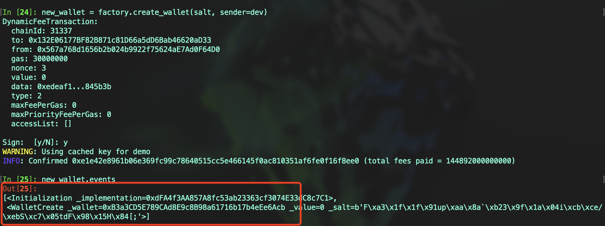
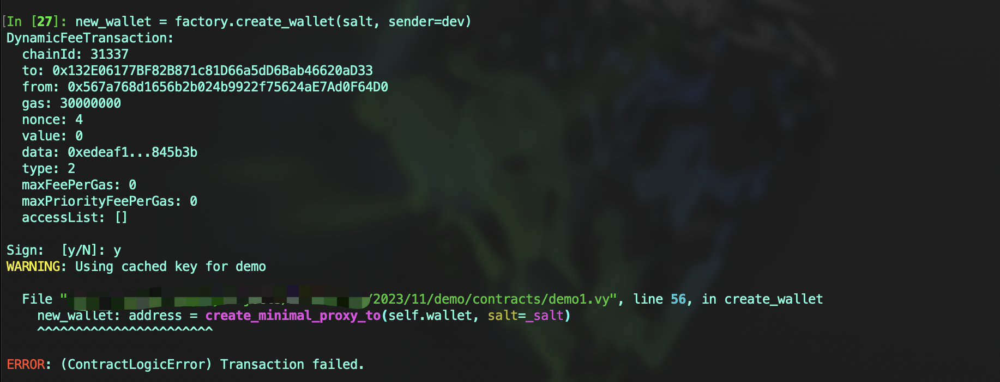

# Vyper 入门: 19. 在合约中创建合约

在以太坊上，合约能够创建其他合约，为智能合约系统提供了复杂和动态功能的构建能力。


在 `Vyper` 中，创建合约的方法有三种：
- `create_minimal_proxy_to`: 用于创建一个符合 `EIP1167` 的最小代理合约。这种代理合约复制原始合约的逻辑，但保持自己的状态。对于用户而言，与直接部署新合约没有区别。
- `create_copy_to`: 用于创建一个现有合约的副本。这个副本将是原始合约的一个完整拷贝，包括其代码和状态。
- `create_from_blueprint`: 用于从一个蓝图合约创建新的合约实例，蓝图合约通常包含通用逻辑。


本节中，重点介绍 `create_minimal_proxy_to` 方法，并以此为例实现一个简单的智能合约钱包。


## 语法说明

```
create_minimal_proxy_to(_target: address, _value: uint256 = 0, _salt: bytes32) -> address
```

- `_target`: 要部署的代理合约地址
- `_value`: 可选， 发送到新合约的 ETH，默认为0
- `_salt`: 可选，确定 `CREATE2` 操作码使用的一个 `bytes32` 值，如果未提供，则默认使用 `CREATE` 部署代理合约。使用 `_salt` 值可以提前预估新合约地址
- 返回值：返回新创建的最小代理合约地址，`salt` 值如果已经使用，代理合约会创建失败
- 注意： 创建合约时无法传递构造函数


## 部署智能合约钱包账户

代码示例:

```
# @version 0.3.9

event Received:
	_sender: indexed(address)
	_amount: indexed(uint256)
	_data: Bytes[1024]

implementation: public(address)


@payable
@external
def __init__(_implementation: address):
	self.implementation = _implementation


@payable
@external
def __default__() -> Bytes[255]:

	if len(msg.data) == 0:
		log Received(msg.sender, msg.value, b"")
		return b""

	response: Bytes[255] = raw_call(
		self.implementation,
		msg.data,
		max_outsize=255,
		value=msg.value,
		is_delegate_call=True
	)

	assert len(response) != 0, "CALL FAIL"
	return response
```


## 部署钱包工厂
工厂合约 `AccountFactory` 负责部署最小代理合约，并在其中包含了一个用于预估合约地址的视图函数。该函数可以根据特定的 `salt` 值预先计算并提供未来部署合约的地址。


合约代码示例:

```

# @version 0.3.9


event WalletCreate:
    _wallet: indexed(address)
    _value: indexed(uint256)
    _salt: indexed(bytes32)


COLLISION_OFFSET: constant(bytes1) = 0xFF

wallet: public(address)
all_wallet_lenght: public(uint256)
all_wallets: public(HashMap[uint256, address])
is_wallet: public(HashMap[address, bool])


@external
def __init__(_wallet: address):
    self.wallet = _wallet


@pure
@internal
def _compute_address(_salt: bytes32, _bytecode_hash: bytes32, _deployer: address) -> address:
    data: bytes32 = keccak256(concat(COLLISION_OFFSET, convert(_deployer, bytes20), _salt, _bytecode_hash))
    return self._convert_keccak256_2_address(data)


@pure
@internal
def _convert_keccak256_2_address(_digest: bytes32) -> address:
    return convert(convert(_digest, uint256) & convert(max_value(uint160), uint256), address)


@view
@external
def compute_address_self(_salt: bytes32, _bytecode_hash: bytes32) -> address:
    return self._compute_address(_salt, _bytecode_hash, self)


@pure
@external
def compute_address(_salt: bytes32, _bytecode_hash: bytes32, _deployer: address) -> address:
    return self._compute_address(_salt, _bytecode_hash, _deployer)


@external
def create_wallet(_salt: bytes32) -> address:
    new_wallet: address = create_minimal_proxy_to(self.wallet, salt=_salt)

    self.all_wallets[self.all_wallet_lenght] = new_wallet
    self.is_wallet[new_wallet] = True
    self.all_wallet_lenght += 1
    
    log WalletCreate(new_wallet, 0, _salt)

    return new_wallet
```


预估合约地址时如何获取 `bytecode_hash` 值？

`Python` 代码示例：

```
from hexbytes import HexBytes


def vyper_proxy_byte_code(_target: str):
    """
    create2 bytecode_hash 
    _target: 代理合约地址
    """

    addr = HexBytes(_target)
    pre = HexBytes("0x602D3D8160093D39F3363d3d373d3d3d363d73")
    post = HexBytes("0x5af43d82803e903d91602b57fd5bf3")
    return HexBytes(pre + (addr + HexBytes(0) * (20 - len(addr))) + post)
```


### 开始部署
1. 首先，合约部署完成之后我们通过 `compute_address_self` 视图函数预估新合约地址，`bytecode_hash` 通过上述的函数 `vyper_proxy_byte_code` 获得，合约需要值类型为 `bytes32`，所以我们需要使用 `Web3` 将值转换成 `bytes32`


2. 调用 `create_wallet` 部署最小代理合约，并检查和预估的地址是否一致，从事件中我们可以看到部署的新合约地址和预估的地址一致




3. 就像之前介绍的一样，每个 `salt` 值只能用一次，如果使用相同的 `salt` 再次去部署合约，则交易会失败




## 注意

在不同区块链上，使用 `create_minimal_proxy_to` 部署的合约地址可能会有所不同，因为不同的 EVM 链对 `CREATE2` 指令的实现可能存在差异。例如，在 `zkSync` 链上，使用标准的地址预估方法可能无法准确预测出实际部署的新合约地址。因此，需要根据特定链的 `CREATE2` 逻辑调整地址预估方法。下面提供了一个适用于 zkSync 的地址预估逻辑示例代码：

```
# @version 0.3.9

interface CreateAddress:
    def compute_address(_salt: bytes32, _bytecode_hash: bytes32, _deployer: address, _input: Bytes[4096]) -> address: pure


CREATE2_PREFIX: constant(bytes32) = 0x2020dba91b30cc0006188af794c2fb30dd8520db7e2c088b7fc7c103c00ca494


@pure
@external
def compute_address(_salt: bytes32, _bytecode_hash: bytes32, _deployer: address, _input: Bytes[4_096]=b"") -> address:

    constructor_input_hash: bytes32 = keccak256(_input)
    data: bytes32 = keccak256(concat(CREATE2_PREFIX, empty(bytes12), convert(_deployer, bytes20), _salt, _bytecode_hash, constructor_input_hash))

    return convert(convert(data, uint256) & convert(max_value(uint160), uint256), address)


@view
@external
def compute_address_self(_salt: bytes32, _bytecode_hash: bytes32, _deployer: address, _input: Bytes[4096]) -> address:
    return CreateAddress(self).compute_address(_salt, _bytecode_hash, _deployer, _input)
```


## 总结

本节中，我们介绍了在 Vyper 中使用 `create_minimal_proxy_to` 部署智能合约账户的方法。在接下来的两节中，我们将探讨 `create_copy_of` 和 `create_from_blueprint` 的使用。

