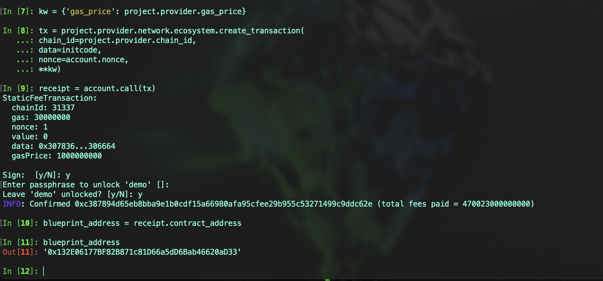
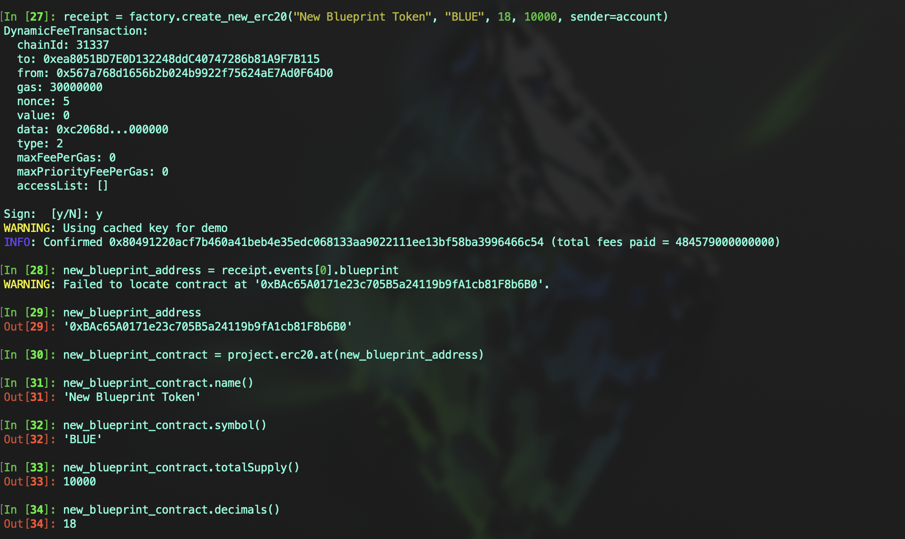

# Vyper 入门: 21. create_from_blueprint

在 `Vyper` 中， `create_from_blueprint` 是一种创建新合约实例的方法。它利用存储在区块链上的初始化代码 `initcode`，从一个特定的“蓝图”合约部署新的合约实例。这种方法相对于直接部署新合约，可以节省 gas 成本，并允许通过蓝图合约调用构造函数

## 特性

1. **独立的状态存储:** 和 `create_copy_of` 一样，`create_from_blueprint` 创建的合约副本与原始合约共享相同的代码，但它们的状态是独立的
2. **部署成本:** 创建过程中的 gas 消耗会根据蓝图合约的复杂性而变
3. **构造函数:** 与 `create_minimal_proxy_to` 和 `create_copy_of` `不同，create_from_blueprint` 允许调用构造函数
4. **应用场景:** 当需要根据统一模板多次创建类似合约，并且每次创建时都需要一些初始化操作时，`create_from_blueprint` 是一个非常合适的选择。

## 语法

```
create_from_blueprint(_target: address, *args, _value: uint256 = 0, raw_args: bool = False, code_offset: int = 0, _salt: bytes32) -> address
```

- `_target`: 要复制的蓝图合约地址
- `*args`: 构造函数参数
- `_value`: 可选，发送到新合约的 ETH，默认为 0
- `raw_args`: 可选，当设置为 `True` 时，它允许将 `*args` 作为单个 `Bytes[...]` 类型的参数传递，这个参数会被直接作为原始字节缓冲区传递给创建操作，比如当你已经有了预先 `ABI` 编码构造函数数据，并希望直接将这些数据用于创建新合约。默认情况下值为 `False`
- `code_offset`: 用于设置合约代码的起始偏移量。通常，应将 `code_offset` 设为 `3`，以符合 `EIP-5202` 的要求。这是因为在遵循 `EIP-5202` 的蓝图合约中，合约代码的前三个字节是固定的 `0xFE7100` 标头，而合约的实际可执行代码从第四个字节开始
- `_salt`: 可选，确定 `CREATE2` 操作码使用的一个 `bytes32` 值，如果未提供，则默认使用 `CREATE` 部署代理合约。使用 `_salt` 值可以提前预估新合约地址

### 编写一个蓝图合约

首先我们编写一个标准的 ERC20 蓝图合约

代码示例:

```
from vyper.interfaces import ERC20
from vyper.interfaces import ERC20Detailed

implements: ERC20
implements: ERC20Detailed

event Transfer:
    sender: indexed(address)
    receiver: indexed(address)
    value: uint256

event Approval:
    owner: indexed(address)
    spender: indexed(address)
    value: uint256

name: public(immutable(String[33]))  # trigger different codegen
symbol: public(immutable(String[32]))
decimals: public(immutable(uint8))

balanceOf: public(HashMap[address, uint256])
allowance: public(HashMap[address, HashMap[address, uint256]])
totalSupply: public(uint256)
minter: address


@external
def __init__(_name: String[32], _symbol: String[32], _decimals: uint8, supply: uint256):
    init_supply: uint256 = supply * 10 ** convert(decimals, uint256)
    name = _name
    symbol = _symbol
    decimals = _decimals
    self.balanceOf[msg.sender] = init_supply
    self.totalSupply = init_supply
    self.minter = msg.sender
    log Transfer(empty(address), msg.sender, init_supply)


@external
def transfer(_to : address, _value : uint256) -> bool:
    self.balanceOf[msg.sender] -= _value
    self.balanceOf[_to] += _value
    log Transfer(msg.sender, _to, _value)
    return True


@external
def transferFrom(_from : address, _to : address, _value : uint256) -> bool:
    assert self.balanceOf[_from] >= _value, "balanceOf underflow"
    self.balanceOf[_from] -= _value
    self.balanceOf[_to] += _value

    assert self.allowance[_from][msg.sender] >= _value, "allowance underflow"
    self.allowance[_from][msg.sender] -= _value
    log Transfer(_from, _to, _value)
    return True


@external
def approve(_spender : address, _value : uint256) -> bool:
    self.allowance[msg.sender][_spender] = _value
    log Approval(msg.sender, _spender, _value)
    return True


@external
def mint(_to: address, _value: uint256):
    assert msg.sender == self.minter  # rekt: non-minter tried to mint
    assert _to != empty(address)
    self.totalSupply += _value
    self.balanceOf[_to] += _value
    log Transfer(empty(address), _to, _value)


@internal
def _burn(_to: address, _value: uint256):
    assert _to != empty(address)
    self.totalSupply -= _value
    self.balanceOf[_to] -= _value
    log Transfer(_to, empty(address), _value)


@external
def burn(_value: uint256):
    self._burn(msg.sender, _value)


@external
def burnFrom(_to: address, _value: uint256):
    self.allowance[_to][msg.sender] -= _value
    self._burn(_to, _value)
```

### 编写蓝图工厂合约

代码示例:

```
from vyper.interfaces import ERC20


event BlueprintCreated:
    blueprint: address


EIP5202_CODE_OFFSET: constant(uint256) = 3
BLUEPRINT: immutable(address)


@external
def __init__(_blueprint_address: address):
    BLUEPRINT = _blueprint_address


@external
def create_new_erc20(_name: String[32], _symbol: String[32], _decimals: uint8, _supply: uint256) -> ERC20:
    new_erc20: address = create_from_blueprint(
        BLUEPRINT,
        _name,
        _symbol,
        _decimals,
        _supply,
        code_offset=EIP5202_CODE_OFFSET
    )

    log BlueprintCreated(new_erc20)
    return ERC20(new_erc20)
```

## 部署蓝图合约

蓝图合约的部署方式和常规的部署存在一些区别，为了正确部署蓝图合约，必须使用特殊的部署字节码。

使用命令 `vyper -f blueprint_bytecode xxx.vy` 将生成部署 `ERC-5202` 兼容蓝图的字节码，也可以编写一个函数生成蓝图字节码，以下提供一个 `ape` 开发框架中代码示例:

```
from ape import project, accounts

def deploy_blueprint(contract, account, **kw):
    initcode = contract.contract_type.deployment_bytecode.bytecode
    if isinstance(initcode, str):
        initcode = bytes.fromhex(initcode.removeprefix("0x"))

    # eip-5202 前导码
    initcode = b"\xfe\x71\x00" + initcode

    # 符合蓝图合约的前导码，可以通过命令直接获得
    initcode = (
        b"\x61" + len(initcode).to_bytes(2, "big") + b"\x3d\x81\x60\x0a\x3d\x39\xf3" + initcode
    )

    if not kw:
        kw = {'gas_price': project.provider.gas_price}

    tx = project.provider.network.ecosystem.create_transaction(
        chain_id=project.provider.chain_id,
        data=initcode,
        nonce=account.nonce,
        **kw
    )
    receipt = account.call(tx)
    return receipt.contract_address


# 调用
# kw 是一个字典，用于存储创建交易时需要的额外关键字参数
kw = {}
account = accounts.load("dev")
blueprint_address = deploy_blueprint(project.Blueprint, account, **kw)
```

### 1. 分别使用 `vyper -f blueprint_bytecode erc20.vy` 和 `vyper -f bytecode erc20.vy` 生成示例 `ERC20` 合约的 `blueprint_bytecode`、`bytecode`，查看两者的区别

**blueprint_bytecode**

```
0x61078a3d81600a3d39f3fe71006106d35150602061...
```


**bytecode**

```
0x6106d3515060206107875f395f51602060208261....
```


从生成的 `bytecode` 中可以看到，蓝图合约新增了前导码，我们现在需要用 `blueprint_bytecode` 部署蓝图合约，而不是普通的 `bytecode`

### 2. 部署合约

在使用 `create_from_blueprint` 方法时，通常不会直接在部署过程中执行构造函数。相反，构造函数的逻辑需要以一种方式嵌入到蓝图合约的初始化代码中，或者在蓝图合约被复制后再单独调用。

比如 `erc20` 合约中有 4 个构造参数，但是部署时不需要传递它，而是在 `create_from_blueprint` 执行时才需要传递

```
new_erc20: address = create_from_blueprint(
    BLUEPRINT,
    _name,
    _symbol,
    _decimals,
    _supply,
    code_offset=EIP5202_CODE_OFFSET
)
```



尝试调用原始蓝图合约的函数会发现，这些函数实际上是无法被执行的


### 3. 使用 `create_from_blueprint` 部署新的蓝图合约

部署新的蓝图合约时传递了 4 个参数，部署完成后尝试调用蓝图合约的函数，可以看到现在是可以执行的



## 总结

`create_from_blueprint` 在需要批量创建合约且每个合约都有独特的初始化需求时尤其有用，注意在蓝图合约部署时，确保使用正确的部署字节码。
